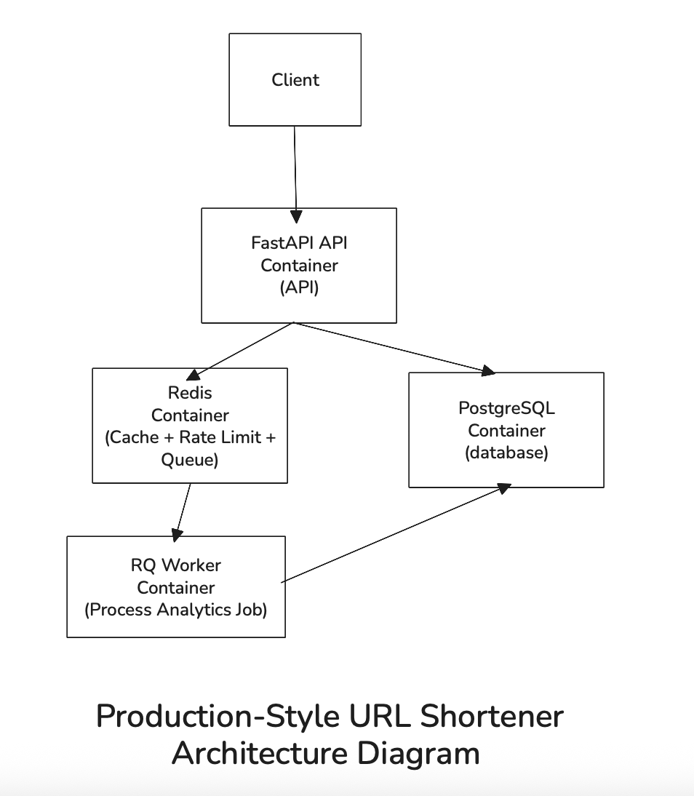

# Production-Style URL Shortener

A production-style backend system that implements a scalable URL shortening service with caching, rate limiting, background workers, and containerized infrastructure.

This service is designed to demonstrate **real backend engineering patterns** such as Redis caching, asynchronous processing, distributed architecture, and Dockerized services.

---

# Architecture Overview

The system is composed of multiple services communicating over a container network.



### Core Ideas

• **Redis caching** prevents heavy database load on redirects
• **Redis queue + worker** processes analytics asynchronously
• **Rate limiting** protects the API from abuse
• **Docker containers** simulate a production-style environment

---

# Tech Stack

### Backend

- Python
- FastAPI
- SQLAlchemy
- PostgreSQL

### Infrastructure

- Redis
- RQ (Redis Queue)
- Docker
- Docker Compose

---

# Features

### URL Shortening

Create short URLs for long links.

```
POST /shorten
```

Example request

```
{
  "original_url": "https://google.com"
}
```

Example response

```
{
  "short_url": "http://localhost:8000/url/abc123"
}
```

Short codes are generated using **Base62 encoding of the database ID**.

Advantages:

- guaranteed uniqueness
- no collision handling required
- constant time generation

---

### Redirect Endpoint

```
GET /{short_code}
```

Redirect flow:

```
Client
 |
Redis cache lookup -> Cache hit -> Send analytics event to queue -> Redirect user
 |
Cache miss -> PostgreSQL
 |
Store result in Redis
 |
Send analytics event to queue
 |
Redirect user
```

---

### Redis Caching

Redis stores:

```
short_code -> original_url
```

Benefits:

- faster redirects
- reduced database load
- low latency

---

### Rate Limiting

Protects the service from abuse.

Example policy:

```
10 URL creation requests per minute per IP
```

Implementation uses Redis atomic counters with expiration.

Example key:

```
rate_limit:{ip}
```

---

### Analytical Endpoint

Analytics endpoint provides insights about a short URL:

```
GET /analytics/{short_code}
```

```
Response:

{
  "short_code": "2",
  "original_url": "https://google.com/",
  "click_count": 4,
  "created_at": "2026-03-10T05:13:26.215345",
  "expires_at": "2026-12-10T05:07:36.089000Z"
}
```

### Asynchronous Analytics

Each redirect generates an analytics event.

Instead of writing directly to the database:

```
redirect
|
enqueue job
|
background worker
|
update database
```

This keeps the redirect path **extremely fast**.

---

# Database Schema

Table: `urls`

```
id           BIGSERIAL PRIMARY KEY
short_code   VARCHAR(10) UNIQUE
original_url TEXT
created_at   TIMESTAMP
expires_at   TIMESTAMP NULL
click_count  INTEGER
```

Primary query:

```
SELECT original_url
FROM urls
WHERE short_code = ?
```

Index:

```
INDEX(short_code)
```

---

# Redis Key Structure

```
{short_code}        -> cached original URL
rate_limit:{ip}     -> rate limit counter
rq:queue:analytics  -> analytics job queue
```

---

# Running the Project

### Requirements

- Docker
- Docker Compose

---

### Start the system

```
docker compose up --build
```

This starts:

```
url_shortener_api
url_shortener_worker
url_shortener_postgres
url_shortener_redis
```

---

### API Documentation

After starting the system, open:

```
http://localhost:8000/docs
```

---

# Example Usage

Create a short URL:

```
POST /shorten
```

Response:

```
{
  "short_url": "http://localhost:8000/url/a1B"
}
```

Visit:

```
http://localhost:8000/url/a1B
```

The user will be redirected to the original URL.

---

### Asynchronous analytics

Without async processing:

```
redirect -> database write
```

With worker queue:

```
redirect -> enqueue job
worker -> database update
```

This prevents the redirect path from becoming a bottleneck.

---

# What This Project Demonstrates

This project demonstrates several real backend engineering concepts:

- REST API design
- database schema modeling
- Redis caching strategies
- distributed rate limiting
- background job queues
- scalable system architecture
- Docker containerization
