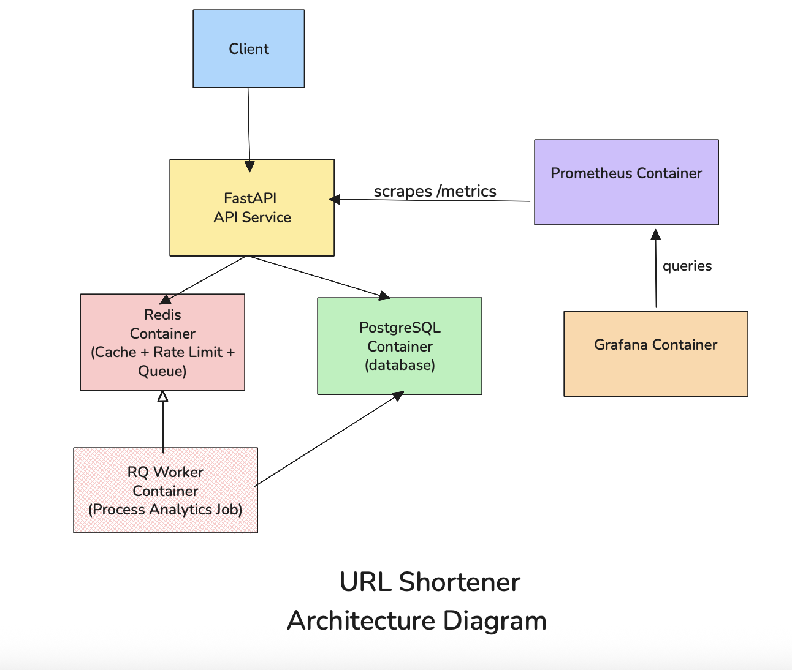

# URL Shortener

A backend service that creates short URLs and redirects them to their original destination.

The project is built to demonstrate common backend engineering patterns such as caching, background job processing, rate limiting, and containerized infrastructure.

More detailed design explanations are available in the [`docs/architecture.md`](docs/architecture.md) document.

---

## Architecture



The system runs as multiple containers:

- FastAPI API service
- PostgreSQL database
- Redis for caching and queues
- RQ worker for background jobs
- Prometheus for metrics
- Grafana for visualization

Docker Compose is used to run the entire stack locally.

---

## Tech Stack

**Backend**

- Python
- FastAPI
- SQLAlchemy

**Infrastructure**

- PostgreSQL
- Redis
- RQ (Redis Queue)
- Docker / Docker Compose
- Prometheus
- Grafana

---

## Features

- URL shortening API
- Redis caching for fast redirects
- Redis-based rate limiting
- asynchronous analytics processing with background workers
- Prometheus metrics
- containerized architecture using Docker

---

## API Endpoints

| Method | Endpoint                | Description              |
| ------ | ----------------------- | ------------------------ |
| POST   | /shorten                | create short URL         |
| GET    | /url/{short_code}       | redirect to original URL |
| GET    | /url/stats/{short_code} | retrieve analytics       |

Interactive API docs are available at:

```
http://localhost:8000/docs
```

---

## Running the Project

Requirements:

- Docker
- Docker Compose

Start the system:

```
docker compose up --build
```

Services started:

```
url_shortener_api
url_shortener_worker
url_shortener_postgres
url_shortener_redis
url_shortener_prometheus
url_shortener_grafana
```

---

## Observability

Metrics are exposed by the API at:

```
/metrics
```

Prometheus scrapes the API periodically to collect operational metrics.

Grafana can be used to visualize request traffic, cache performance, and latency.

```
Grafana UI: http://localhost:3000
Prometheus UI: http://localhost:9090
```

---

## Example Request

Create a short URL

```
POST /shorten
```

```
{
  "original_url": "https://google.com"
}
```

Response

```
{
  "short_url": "http://localhost:8000/url/a1B"
}
```

---

## Documentation

Detailed system design and implementation notes:

[`docs/architecture.md`](docs/architecture.md)

---

## Purpose

This project demonstrates backend engineering concepts such as:

- API design
- caching strategies
- asynchronous background processing
- rate limiting
- containerized service architecture
- observability with metrics and dashboards
